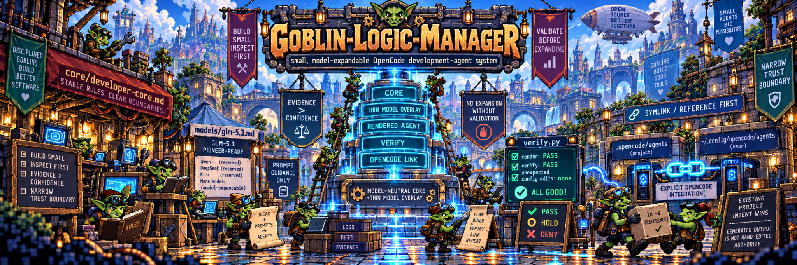
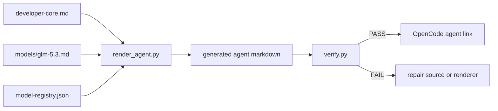

# Goblin-Logic-Manager


<p align="center">
  
</p>

### 🧪 Dynamic Documentation

**[Open the Goblin-Logic-Manager Dynamic Manual →](https://es-3581100.github.io/Goblin-Logic-Manager/)**

`README.md` remains the portable GitHub-native documentation authority. The
Dynamic Manual is regenerated from the current README by GitHub Actions and
adds the Goblin visual shell, sticky navigation, responsive layout, copy
controls, and build provenance.


> **A small, model-expandable OpenCode development-agent system with a deliberately narrow trust boundary.**

`Goblin-Logic-Manager` (GLM) separates **stable development behavior** from **model-specific prompt tuning**, renders the two into an OpenCode agent, and keeps installation auditable by reference instead of merging an unfamiliar automation stack into a user's existing configuration.

```text
status          v0.1.0 — GLM pioneer release
pioneer model   GLM-5.3
architecture    model-neutral core + thin model overlay
install style   symlink/reference-first
authority       prompt guidance only; no implied execution authority
expansion gate  NO EXPANSION WITHOUT VALIDATION
```

> **Build small. Inspect first. Validate before expanding. Report only what the evidence supports.**

---

## 0. Read this first

Goblin is intentionally **not** a giant agent framework.

It is a compact development-control surface built around four ideas:

1. **Stable rules belong in a model-neutral core.**
2. **Model quirks belong in thin, replaceable overlays.**
3. **Generated agent files should be reproducible from source.**
4. **Installing an agent should not silently reorganize the user's OpenCode configuration.**

The first tuned profile is **GLM-5.3**, but the design is explicitly prepared for other model families without cloning the whole development philosophy.

### Project promise

Goblin should make it easy to answer:

```text
What rules are stable?
What behavior is model-specific?
What file did the model actually receive?
What changed since the last render?
What did installation expose to OpenCode?
What evidence supports a PASS?
```

If the repository cannot answer those questions clearly, the design has drifted.

---

# 1. Focus

Goblin-Logic-Manager is tuned for practical application work:

- small apps and developer utilities
- Android / Kotlin
- browser apps and Chrome extensions
- Linux desktop tooling
- Xubuntu / XFCE-friendly workflows
- local-first utilities
- practical UI implementation
- reproducible builds
- focused verification
- evidence-backed completion reporting

It is especially intended for work where a model should behave like a disciplined developer rather than a demo generator.

---

# 2. Non-goals

Goblin is **not** trying to become:

- a universal autonomous coding platform
- a hidden orchestration layer
- a replacement for OpenCode
- a package manager
- a shell installer with broad machine authority
- a generic "AI dashboard"
- a fake multi-agent organization chart
- a model benchmark masquerading as a development system
- a place to bury model-specific workarounds inside supposedly universal rules

The project favors a small number of explicit surfaces over clever implicit behavior.

---

# 3. Design contract

The architecture can be summarized as:

```text
stable development rules
          +
small model-specific overlay
          |
          v
deterministically rendered agent
          |
          v
explicit OpenCode integration point
```

A model adapter is a **prompt overlay, not a replacement architecture**.

### Invariant set

| ID | Invariant | Meaning |
|---|---|---|
| `G1` | Core is model-neutral | Generic development rules do not depend on GLM-specific quirks. |
| `G2` | Overlays are thin | A model file changes only behavior demonstrated to be model-sensitive. |
| `G3` | Render is reproducible | The generated OpenCode agent is derived from inspectable source files. |
| `G4` | Install is narrow | Setup exposes explicit links instead of copying a framework into live config. |
| `G5` | Evidence outranks confidence | Completion claims follow verification, not model narration. |
| `G6` | Expansion is gated | New architecture is not added merely because it is aesthetically attractive. |
| `G7` | Existing project intent wins | Local project sources outrank Goblin's generic UI or implementation preferences. |
| `G8` | Generated output is not hand-edited authority | Source rules and overlays remain the maintainable inputs. |

---

# 4. Repository map

```text
Goblin-Logic-Manager/
├── AGENTS.md                         # repo-wide development rules
├── README.md                         # human + agent orientation
├── model-registry.json               # model-family registry
├── core/
│   └── developer-core.md             # stable, model-neutral behavior
├── models/
│   ├── README.md
│   └── glm-5.3.md                    # pioneer tuning overlay
├── scripts/
│   ├── render_agent.py               # builds an OpenCode agent
│   └── verify.py                     # repo consistency checks
├── .opencode/
│   └── agents/
│       └── goblin-logic-manager.md   # generated GLM-5.3 agent
├── docs/
│   ├── ADDING-A-MODEL.md
│   ├── DESIGN.md
│   └── RELEASE-NOTES-v0.1.0.md
├── CHANGELOG.md
├── VERSION
└── Makefile
```

### Authority map

```text
┌──────────────────────────────┐
│ core/developer-core.md       │
│ stable development behavior │
└──────────────┬───────────────┘
               │
               │ compose
               │
┌──────────────▼───────────────┐
│ models/<family>.md           │
│ model-sensitive overlay      │
└──────────────┬───────────────┘
               │
               │ render
               │
┌──────────────▼───────────────┐
│ .opencode/agents/*.md        │
│ generated runtime prompt     │
└──────────────┬───────────────┘
               │
               │ explicit link
               │
┌──────────────▼───────────────┐
│ ~/.config/opencode/agents/   │
│ active OpenCode exposure     │
└──────────────────────────────┘
```

The generated file is an output surface. The core and overlay remain the maintainable source surfaces.

---

# 5. The render pipeline

Goblin's core mechanism should remain boring enough to audit.



### Desired properties

The render path should be:

- deterministic for the same inputs;
- inspectable before activation;
- model-registry aware;
- free of hidden network dependence;
- free of silent edits to the user's global OpenCode configuration;
- verifiable without needing the model to explain what it thinks happened.

### Conceptual Kotlin model

Goblin is currently rendered by the repository's existing tooling. The Kotlin below is a **design model**, not a claim that the current renderer is implemented in Kotlin.

```kotlin
data class DeveloperCore(
    val markdown: String,
)

data class ModelOverlay(
    val family: String,
    val markdown: String,
    val status: ModelStatus,
)

enum class ModelStatus {
    PIONEER_READY,
    RESERVED,
    EXPERIMENTAL,
    DISABLED,
}

data class RenderedAgent(
    val family: String,
    val markdown: String,
    val sourceInputs: List<String>,
)

fun renderAgent(
    core: DeveloperCore,
    overlay: ModelOverlay,
): RenderedAgent {
    require(overlay.status != ModelStatus.DISABLED)

    return RenderedAgent(
        family = overlay.family,
        markdown = buildString {
            appendLine(core.markdown.trim())
            appendLine()
            appendLine("---")
            appendLine()
            appendLine(overlay.markdown.trim())
        },
        sourceInputs = listOf(
            "core/developer-core.md",
            "models/${overlay.family}.md",
        ),
    )
}
```

The important part is not Kotlin itself. The important part is that the data flow is obvious.

---

# 6. Why GLM-5.3 first?

GLM-5.3 is the pioneer profile because it is the model this repository is actively being shaped around.

The overlay deliberately favors:

- Markdown-first instructions
- direct imperative language
- short execution loops
- minimal prompt ceremony
- natural tool use
- evidence-driven completion
- no fake tool syntax
- no rigid delegation theater

The **core rules are not GLM-specific**.

Future Qwen, DeepSeek, Kimi, and other model families can add their own overlays without forking the underlying development philosophy.

### Model status

| Family | Status | Purpose |
|---|---|---|
| GLM-5.3 | **pioneer-ready** | First active and tuned profile |
| Qwen | reserved | Future evidence-backed adapter |
| DeepSeek | reserved | Future evidence-backed adapter |
| Kimi | reserved | Future evidence-backed adapter |

`reserved` means the architecture has a slot for that family.

It does **not** mean that family has been tuned, verified, benchmarked, or promoted.

---

# 7. Quick start

Render the default profile:

```bash
python3 scripts/render_agent.py
```

Verify the repository:

```bash
python3 scripts/verify.py
```

Or use the Makefile:

```bash
make render
make verify
```

Expected generated agent:

```text
.opencode/agents/goblin-logic-manager.md
```

### Minimal success condition

A normal local change should be able to answer:

```text
render: PASS
verify: PASS
generated agent: present
unexpected config edits: none
```

---

# 8. Recommended OpenCode setup: symlink, do not merge

For a persistent local installation, keep Goblin-Logic-Manager in its **own Git repository** and expose only the intended surfaces to OpenCode with small, explicit symlinks.

This is preferable to copying an unfamiliar agent framework directly into:

```text
~/.config/opencode/
```

because that directory may already contain configuration you trust.

## Example layout

```text
~/repos/Build Dev/build-dev-goblin-logic-manager/Goblin-Logic-Manager/
    ├── core/
    ├── models/
    ├── scripts/
    ├── docs/
    └── .opencode/agents/goblin-logic-manager.md

~/.config/opencode/
    ├── goblin-logic-manager -> <repo>/Goblin-Logic-Manager/
    └── agents/
        └── goblin-logic-manager.md -> <repo>/.opencode/agents/goblin-logic-manager.md
```

## Create the repository link

Adjust the source path if the repository lives elsewhere.

```bash
ln -s \
  "/home/sticky-ricky/repos/Build Dev/build-dev-goblin-logic-manager/Goblin-Logic-Manager" \
  "$HOME/.config/opencode/goblin-logic-manager"
```

Verify it:

```bash
ls -ld "$HOME/.config/opencode/goblin-logic-manager"
readlink -f "$HOME/.config/opencode/goblin-logic-manager"
```

## Expose only the generated agent

```bash
mkdir -p "$HOME/.config/opencode/agents"

ln -s \
  "/home/sticky-ricky/repos/Build Dev/build-dev-goblin-logic-manager/Goblin-Logic-Manager/.opencode/agents/goblin-logic-manager.md" \
  "$HOME/.config/opencode/agents/goblin-logic-manager.md"
```

Verify the exact target:

```bash
ls -l "$HOME/.config/opencode/agents/goblin-logic-manager.md"
readlink -f "$HOME/.config/opencode/agents/goblin-logic-manager.md"

test -f "$HOME/.config/opencode/agents/goblin-logic-manager.md" \
  && echo "PASS: Goblin agent linked and readable" \
  || echo "FAIL: Goblin agent is not readable"
```

### Do not blindly overwrite

If either destination already exists, inspect it first.

```bash
ls -ld \
  "$HOME/.config/opencode/goblin-logic-manager" \
  "$HOME/.config/opencode/agents/goblin-logic-manager.md" \
  2>/dev/null
```

Do **not** make `ln -sf` the default installation strategy.

---

# 9. Why the symlink setup is safer for newer users

A random GitHub agent repository may contain much more than a prompt file:

- installers
- shell scripts
- package scripts
- plugins
- hooks
- MCP configuration
- commands
- policies
- executable helpers
- config migrations
- code that rewrites existing settings

Copying or running a project directly inside `~/.config/opencode/` can blur the boundary between:

```text
code I am evaluating
```

and:

```text
configuration I already trust
```

The symlink approach is deliberately boring.

It means:

- the downloaded project stays in its own Git repository;
- Git can show what changed during updates;
- the project is easy to pin to a commit;
- the project is easy to diff before use;
- your existing `opencode.jsonc` is not replaced merely to install Goblin;
- your existing `AGENTS.md` is not replaced;
- your plugins, commands, policies, and hooks remain separate;
- the active OpenCode exposure is explicit;
- rollback means removing links instead of untangling copied files.

### Important limitation

This is a **trust-boundary improvement, not a security sandbox**.

A malicious or compromised repository can still be dangerous if you:

- execute its scripts;
- install its packages;
- run its hooks;
- start its MCP servers;
- grant its agent broad tools;
- grant elevated permissions;
- accept config rewrites you have not reviewed.

Inspect source and diffs before execution.

---

# 10. Removal / rollback

Removing the integration links does not delete the source repository.

```bash
rm "$HOME/.config/opencode/agents/goblin-logic-manager.md"
rm "$HOME/.config/opencode/goblin-logic-manager"
```

`rm` removes the symlinks, **not** the linked Goblin repository.

Verify rollback:

```bash
test ! -e "$HOME/.config/opencode/agents/goblin-logic-manager.md" \
  && echo "PASS: agent link removed"

test ! -e "$HOME/.config/opencode/goblin-logic-manager" \
  && echo "PASS: repo link removed"
```

---

# 11. Installation contract for coding agents

If an AI coding agent performs setup, give it a narrow contract instead of open-ended authority.

```text
Install Goblin-Logic-Manager by reference, not by merging it into my OpenCode config.

1. Keep the Goblin repository in its own Git working tree.
2. Inspect ~/.config/opencode before changing anything.
3. Create only these integration points unless I explicitly approve more:
   - ~/.config/opencode/goblin-logic-manager -> Goblin repo root
   - ~/.config/opencode/agents/goblin-logic-manager.md -> generated Goblin agent
4. If either destination already exists, stop and report it; do not overwrite it.
5. Do not modify opencode.jsonc, AGENTS.md, plugins, commands, policies, hooks,
   package files, MCP configuration, or unrelated symlinks as part of setup.
6. Verify both links with readlink -f.
7. Verify the generated agent target is a readable regular file.
8. Report the exact resolved paths.
9. Report any deviation from this contract.
10. Do not claim installation PASS if any verification step was skipped.
```

### Agent result shape

A setup agent should return something close to:

```text
status: PASS | HOLD | FAIL
repo_link:
  requested: ~/.config/opencode/goblin-logic-manager
  resolved:  <absolute path>
agent_link:
  requested: ~/.config/opencode/agents/goblin-logic-manager.md
  resolved:  <absolute path>
existing_files_overwritten: false
unrequested_config_changes: false
verification:
  repo_link_resolves: true
  agent_link_resolves: true
  agent_target_readable: true
deviations: []
```

This is intentionally stricter than "it seems installed."

---

# 12. The expansion gate

## Core rule

> **NO EXPANSION WITHOUT VALIDATION.**

Before adding:

- pages
- frameworks
- dependencies
- component families
- services
- navigation systems
- state layers
- background workers
- abstraction layers
- design systems
- decorative subsystems
- agent orchestration
- new model families

the developer should:

1. inspect the current implementation;
2. identify authoritative project sources;
3. verify current behavior;
4. identify the actual deficiency;
5. determine whether expansion is necessary;
6. repair current-scope problems first when practical;
7. add the smallest new surface that solves the demonstrated need;
8. verify again.

### Gate states

```text
PASS  current scope is coherent enough to expand
HOLD  direction may be valid, but current scope needs repair first
DENY  proposal conflicts with evidence, authority, usability, or justified scope
```

### Kotlin-style gate model

```kotlin
enum class ExpansionDecision {
    PASS,
    HOLD,
    DENY,
}

data class ExpansionGate(
    val decision: ExpansionDecision,
    val evidence: List<String>,
    val blockers: List<String> = emptyList(),
    val permittedNextScope: String? = null,
)
```

A `PASS` without evidence should be treated as an unsupported claim.

---

# 13. UI philosophy

Goblin rejects generic model-generated application styling.

It should not automatically reach for:

- blue/gray "AI dashboards"
- purple gradients
- endless rounded cards
- pills everywhere
- arbitrary glow
- fake system-health panels
- fake agent activity
- fake token counters
- decorative graphs with no user task
- giant marketing hero sections inside practical tools

Existing project sources outrank invented styling:

```text
project screenshots
> design references
> theme tokens
> existing component vocabulary
> product constraints
> generic Goblin preferences
> model taste
```

A tool should look **usable before it looks marketable**.

---

# 14. OPENRNDR / Kotlin visual-reference node

Goblin may carry structured reference nodes for implementation or design research.

The following source node is intentionally a **reference**, not an activated dependency.

```yaml
prompt_node:
  id: "c640ffd8-4e88-4aa4-a5fa-bb51f7cd04e7"
  title: "OpenRNDR-Kotlin-Refs"
  summary: "OpenRNDR (Kotlin creative-coding framework) — reference set for a Kotlin-side visual/UI layer."
  tree_path: "Prompt Tree/General"
  keywords:
    - "openrndr"
    - "kotlin"
    - "creative-coding"
    - "graphics"
  created_at: "2026-09-08T20:44:09.356Z"
  updated_at: "2026-09-09T17:29:57.654Z"
  reference_status: "candidate"
  activation: "not-wired"
  body: |-
    # OpenRNDR — Kotlin creative-coding reference

    - https://openrndr.org/made-with-openrndr/
    - https://guide.openrndr.org/kotlinLanguageAndTools/
    - https://guide.openrndr.org/programBasics/
    - https://guide.openrndr.org/drawing/
    - https://guide.openrndr.org/interaction/
    - https://guide.openrndr.org/animation/
    - https://guide.openrndr.org/extensions/
    - https://guide.openrndr.org/fileIO/
    - https://guide.openrndr.org/debugging/
    - https://guide.openrndr.org/useCases/
    - https://guide.openrndr.org/bestPractices/
```

### Reference interpretation

The node means:

```text
OPENRNDR is worth studying for:
  - real-time drawing
  - interaction
  - animation
  - render-loop structure
  - extension/lifecycle design
  - Kotlin-native graphics patterns

The node does NOT mean:
  - OPENRNDR is installed
  - OPENRNDR is a Goblin dependency
  - NodeX already uses OPENRNDR
  - a canvas renderer has been approved
  - a DOM renderer should be replaced
```

The current OPENRNDR API exposes application surfaces for JVM and web targets and includes an `openrndr-webgl` module. Treat that as a reason to **evaluate** web/canvas use when a real need appears, not as automatic authorization to add the framework.

### Candidate decision tree

```text
Need richer visual behavior?
        |
        +-- no --> keep current UI
        |
        +-- yes
             |
             +-- DOM/CSS handles it cleanly? --> stay DOM-native
             |
             +-- canvas/render-loop materially helps?
                    |
                    +-- no --> stay DOM-native
                    |
                    +-- yes --> prototype smallest OPENRNDR/WebGL slice
                                  |
                                  +-- verify build/runtime/size/interop
                                  |
                                  +-- PASS -> consider adoption
                                  +-- HOLD -> repair prototype
                                  +-- DENY -> remove candidate
```

---

# 15. Prompt-node rendering contract

Reference nodes should be renderable into human-readable documentation without losing machine-readable identity.

### Suggested Kotlin data model

```kotlin
import kotlinx.datetime.Instant

data class PromptNode(
    val id: String,
    val title: String,
    val summary: String,
    val treePath: String,
    val keywords: List<String>,
    val createdAt: Instant?,
    val updatedAt: Instant?,
    val body: String,
)

data class RenderedPromptNode(
    val heading: String,
    val metadataTable: Map<String, String>,
    val bodyMarkdown: String,
)
```

### Markdown renderer

```kotlin
fun PromptNode.renderMarkdown(): String = buildString {
    appendLine("## $title")
    appendLine()
    appendLine("> $summary")
    appendLine()
    appendLine("| Field | Value |")
    appendLine("|---|---|")
    appendLine("| ID | `$id` |")
    appendLine("| Tree path | `$treePath` |")
    appendLine("| Keywords | ${keywords.joinToString { "`$it`" }} |")

    createdAt?.let {
        appendLine("| Created | `$it` |")
    }

    updatedAt?.let {
        appendLine("| Updated | `$it` |")
    }

    appendLine()
    appendLine(body.trim())
}
```

### Renderer invariants

A prompt-node renderer should:

- preserve the node ID;
- preserve the source body;
- normalize accidental duplicate quoting in keyword fields;
- avoid inventing activation state unless it is explicitly added by the project;
- keep source metadata separate from rendered prose;
- treat timestamps as provenance, not content authority;
- keep a stable output ordering;
- make duplicate-node detection possible before rendering;
- avoid silently merging two different nodes that merely share a title.

### Duplicate-node rule

The same `OpenRNDR-Kotlin-Refs` node was supplied repeatedly with the same ID and content.

For rendering:

```text
same ID + same semantic content
=> render once

same ID + changed content
=> treat as a version/conflict requiring reconciliation

different ID + same title
=> preserve both until explicitly deduplicated
```

This prevents a prompt tree export from inflating documentation through repeated copies.

---

# 16. Verification philosophy

A feature is not done because code was written.

Verification should match the claim.

| Level | Evidence | Appropriate claim |
|---|---|---|
| V0 | visual inspection only | design observation |
| V1 | syntax / format check | file parses |
| V2 | focused compile / type-check | touched code compiles |
| V3 | focused tests | targeted behavior passes |
| V4 | broader tests | wider regression confidence |
| V5 | integration check | connected components cooperate |
| V6 | package/build artifact | distributable artifact exists |
| V7 | runtime smoke test | application starts / core path runs |
| V8 | device/browser verification | target environment actually exercised |

### Example

If Android builds but no device or emulator was available:

```text
APK build: PASS
install: NOT TESTED
launch: NOT TESTED
device runtime: NOT VERIFIED
```

Do not collapse that into:

```text
Android: PASS
```

Evidence should get more precise as claims get stronger.

---

# 17. Evidence-first completion format

A Goblin-guided development pass should prefer compact evidence over narrative confidence.

```text
status: PASS | PARTIAL | HOLD | FAIL

summary:
- what changed
- why it changed

files_touched:
- exact paths

verification:
- command/check: result
- command/check: result

runtime:
- verified | not verified | not applicable

limitations:
- unresolved facts
- untested surfaces
- known blockers

next:
- smallest justified next step
```

### Unsupported completion language to avoid

Avoid claims like:

- "fully production ready" without production evidence;
- "works perfectly" after static inspection;
- "all tests pass" if only one suite was run;
- "safe" when only formatting was verified;
- "installed" when a symlink target was never resolved.

---

# 18. Model adapter lifecycle

Do not clone the entire agent and edit random lines.

Use this lifecycle:

```text
OBSERVE
  |
  v
collect model-specific failure/success evidence
  |
  v
ISOLATE
  |
  v
identify behavior that is actually model-sensitive
  |
  v
PATCH
  |
  v
write smallest overlay change
  |
  v
RENDER
  |
  v
generate agent output
  |
  v
VERIFY
  |
  v
test source consistency + observed behavior
  |
  v
PROMOTE
```

### Adding another model

1. add a registry entry;
2. collect real failure/success evidence;
3. identify only the behavior that differs from the core;
4. write the smallest overlay;
5. render;
6. verify;
7. document limitations;
8. promote only after evidence supports the profile.

See [`docs/ADDING-A-MODEL.md`](docs/ADDING-A-MODEL.md).

---

# 19. Suggested model-registry semantics

A registry entry should be able to distinguish between architectural availability and actual support.

Conceptually:

```json
{
  "family": "glm-5.3",
  "status": "pioneer-ready",
  "overlay": "models/glm-5.3.md",
  "claims": {
    "renderable": true,
    "actively_tuned": true,
    "verified": true
  }
}
```

A reserved family should look more like:

```json
{
  "family": "deepseek",
  "status": "reserved",
  "overlay": null,
  "claims": {
    "renderable": false,
    "actively_tuned": false,
    "verified": false
  }
}
```

Do not let the presence of a name in the registry imply support that has not been demonstrated.

---

# 20. Source precedence

When Goblin enters an existing project, it should not treat its own defaults as product authority.

Suggested precedence:

```text
1. explicit user instruction
2. authoritative project requirements
3. current source code and tests
4. project-local design system / screenshots / tokens
5. documented repository conventions
6. Goblin model-neutral development core
7. model overlay preferences
8. generic model taste
```

If levels disagree, report the conflict instead of quietly choosing the most convenient one.

---

# 21. UI expansion checklist

Before adding a visual subsystem:

- [ ] inspect existing layout and component vocabulary;
- [ ] identify the user task that is currently blocked;
- [ ] identify whether the problem is visual, structural, or data-related;
- [ ] check whether existing CSS/components can solve it;
- [ ] verify whether interaction requires canvas/WebGL at all;
- [ ] avoid replacing usable native controls for visual novelty;
- [ ] avoid fake telemetry;
- [ ] avoid decorative information density;
- [ ] add the smallest new primitive;
- [ ] verify keyboard and pointer behavior when relevant;
- [ ] verify browser/runtime behavior;
- [ ] compare against project references before calling it done.

OPENRNDR belongs **after** the "does this actually need a render loop?" question, not before it.

---

# 22. Update workflow

Recommended local update flow:

```bash
cd "/home/sticky-ricky/repos/Build Dev/build-dev-goblin-logic-manager/Goblin-Logic-Manager"

git status --short
git fetch
git log --oneline --decorate --max-count=10
```

Review the incoming diff before changing the checked-out version.

Then, after updating:

```bash
python3 scripts/render_agent.py
python3 scripts/verify.py
readlink -f "$HOME/.config/opencode/agents/goblin-logic-manager.md"
```

Because the OpenCode integration points at the repository, you do not need to recopy generated files into the config tree after every safe update.

---

# 23. Troubleshooting

## "The symlink already exists"

Inspect it:

```bash
ls -ld "$HOME/.config/opencode/goblin-logic-manager"
readlink "$HOME/.config/opencode/goblin-logic-manager"
readlink -f "$HOME/.config/opencode/goblin-logic-manager"
```

Do not overwrite until you know whether it points at:

- the expected repository;
- an older Goblin checkout;
- a different project;
- a broken path.

## "The generated agent link is broken"

Check both sides:

```bash
readlink "$HOME/.config/opencode/agents/goblin-logic-manager.md"

test -f \
  "/home/sticky-ricky/repos/Build Dev/build-dev-goblin-logic-manager/Goblin-Logic-Manager/.opencode/agents/goblin-logic-manager.md" \
  && echo "source exists"
```

If the source is missing, render first:

```bash
python3 scripts/render_agent.py
```

## "I edited the generated agent directly"

Treat the generated file as derived output.

Move the real change into:

```text
core/developer-core.md
```

or the relevant:

```text
models/<family>.md
```

Then render again.

## "A new model seems to work with the GLM prompt"

That is evidence worth recording, not enough evidence to claim a tuned adapter.

Create a proper model overlay only after identifying which differences are actually necessary.

---

# 24. Repository hygiene

Before a release or meaningful checkpoint:

```bash
git status --short
python3 scripts/render_agent.py
python3 scripts/verify.py
git diff --check
```

Recommended questions:

```text
Are generated files current?
Did any model-specific workaround leak into the core?
Did the registry claim more support than exists?
Did setup instructions broaden authority?
Did documentation imply runtime verification that did not happen?
Did a reference dependency become an accidental dependency?
```

---

# 25. Release gate

A release should not be cut merely because the README looks complete.

### Minimum release checklist

- [ ] version updated;
- [ ] changelog updated;
- [ ] release notes updated;
- [ ] default agent renders;
- [ ] repository verification passes;
- [ ] generated agent is current;
- [ ] model registry is internally consistent;
- [ ] no accidental config files or secrets are included;
- [ ] install instructions were checked against the actual layout;
- [ ] rollback instructions still work;
- [ ] model support claims match evidence;
- [ ] reference-only integrations remain clearly labeled;
- [x] license status is explicit — MIT.

---

# 26. Security and trust notes

Goblin's setup philosophy reduces accidental config entanglement, but does not remove the need for normal repository review.

Especially inspect:

```text
*.sh
package.json scripts
Makefile targets
installers
hooks
plugins
MCP server definitions
commands
policy files
generated executables
download helpers
sudo usage
network bootstrap code
```

### Rule of thumb

```text
A prompt file can influence an agent.
An executable can influence the machine.
A config rewrite can influence every future agent session.
```

Treat those as different trust surfaces.

---

# 27. For repository reviewers

A reviewer should be able to audit Goblin in this order:

```text
1. README.md
2. AGENTS.md
3. core/developer-core.md
4. model-registry.json
5. models/glm-5.3.md
6. scripts/render_agent.py
7. scripts/verify.py
8. generated .opencode agent
9. docs/DESIGN.md
10. release notes / changelog
```

The review should ask whether the generated output follows from the declared inputs without unexpected authority or hidden behavior.

---

# 28. For coding agents entering this repository

Use this orientation packet:

```text
You are working inside Goblin-Logic-Manager.

Before editing:
1. Read README.md.
2. Read AGENTS.md.
3. Inspect git status.
4. Identify whether the requested change belongs to:
   a. model-neutral core,
   b. model overlay,
   c. renderer,
   d. verification,
   e. documentation,
   f. generated output.
5. Do not hand-edit generated output as the source of truth.
6. Do not broaden installation authority.
7. Do not add a framework merely because it is available.
8. If UI work is requested, inspect existing project references first.
9. Run the narrowest relevant verification.
10. Report only evidence-backed results.

Primary gate:
NO EXPANSION WITHOUT VALIDATION.
```

---

# 29. Project status

**v0.1.0 — GLM pioneer release**

Current state:

```text
core architecture          present
GLM-5.3 overlay            pioneer-ready
other model families       reserved only
renderer                    present
verification helper         present
generated OpenCode agent    present
OPENRNDR integration        reference only / not wired
license                     MIT
```

The architecture is prepared for future model families while only claiming tuning for GLM-5.3.

---

# 30. License

Goblin-Logic-Manager is released under the **MIT License**.

See [`LICENSE`](LICENSE) for the full license text.

---

# 31. Reference index

## Goblin internal

- [`AGENTS.md`](AGENTS.md)
- [`core/developer-core.md`](core/developer-core.md)
- [`models/README.md`](models/README.md)
- [`models/glm-5.3.md`](models/glm-5.3.md)
- [`docs/ADDING-A-MODEL.md`](docs/ADDING-A-MODEL.md)
- [`docs/DESIGN.md`](docs/DESIGN.md)
- [`docs/RELEASE-NOTES-v0.1.0.md`](docs/RELEASE-NOTES-v0.1.0.md)

## OPENRNDR candidate references

- <https://openrndr.org/>
- <https://openrndr.org/made-with-openrndr/>
- <https://guide.openrndr.org/kotlinLanguageAndTools/>
- <https://guide.openrndr.org/programBasics/>
- <https://guide.openrndr.org/drawing/>
- <https://guide.openrndr.org/interaction/>
- <https://guide.openrndr.org/animation/>
- <https://guide.openrndr.org/extensions/>
- <https://guide.openrndr.org/fileIO/>
- <https://guide.openrndr.org/debugging/>
- <https://guide.openrndr.org/useCases/>
- <https://guide.openrndr.org/bestPractices/>

---

## Closing rule

```text
          BUILD SMALL
              │
              ▼
            INSPECT
              │
              ▼
           VALIDATE
              │
        ┌─────┴─────┐
        │           │
      PASS         HOLD
        │           │
        ▼           ▼
     EXPAND       REPAIR
        │           │
        └─────┬─────┘
              ▼
            VERIFY
```

> **No expansion without validation. No completion claim without evidence. No hidden merge into user trust.**

---

*Image by GPT5.6-SOL.*

## Field-verified runtime smoke

Goblin-Logic-Manager v0.1.1 has been field-tested against:

- OpenCode: `1.18.30`
- Model route: `tokenrouter/z-ai/glm-5.3-free`

### Local runtime smoke

Run `./scripts/smoke-goblin-runtime.sh`.

Verified:

- generated Goblin agent
- GLM model route
- 22-skill routing
- NO SKILL SOUP invariant
- ledger-aware closeout precedence
- isolated install and rollback
- bounded wait behavior
- OpenCode agent discovery
- OpenCode model discovery

### Live continuity smoke

Run `./scripts/smoke-opencode-live.sh`.

The live smoke uses real model calls and may consume provider quota.

Field verification proved:

- live Goblin closeout: PASS
- 300-second inner timeout / 310-second outer guard: PASS
- durable chunk return: PASS
- `COMPACT_READY`: PASS
- independent cold session: PASS
- cold-session `RE_GROUNDED`: PASS
- durable chunk-return hash unchanged: PASS
- unauthorized writes: 0

### Continuity authority

**Goblin owns continuity. OpenCode compaction is an optimization.**

The governing runtime rules are:

- **EXTERNALIZE BEFORE COMPACTING.**
- **WAIT IN THE RUNTIME, NOT IN THE MODEL.**

The mandatory continuity release gate is `COLD_SESSION_REGROUND=PASS`.

Native OpenCode compaction is a best-effort compatibility feature and is not the authority for Goblin context continuity.

### OpenCode 1.18.30 compatibility note

During field verification, OpenCode's native summarize endpoint returned HTTP 500 when used with `tokenrouter/z-ai/glm-5.3-free`.

Goblin classified this as `NATIVE_COMPACTION_COMPATIBILITY=KNOWN_FAILURE` and continued through its durable recovery path.

A completely independent OpenCode session then recovered successfully from the durable chunk return and returned `RE_GROUNDED` without modifying the checkpoint or making unauthorized writes.

Current release status: **FIELD_VERIFIED_RELEASE_PASS**.

---

## If you liked this...

Check out **[Goblin-D.M.T.](https://github.com/es-3581100/Goblin-D.M.T.)** — a model-agnostic OpenCode control runtime for bounded exploration, evidence-driven decisions, lazy skill routing, persistent state, verification, and user-gated execution.
